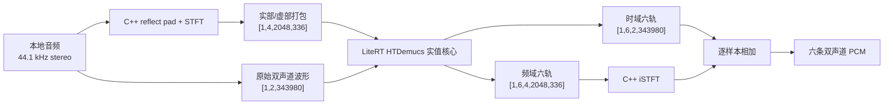
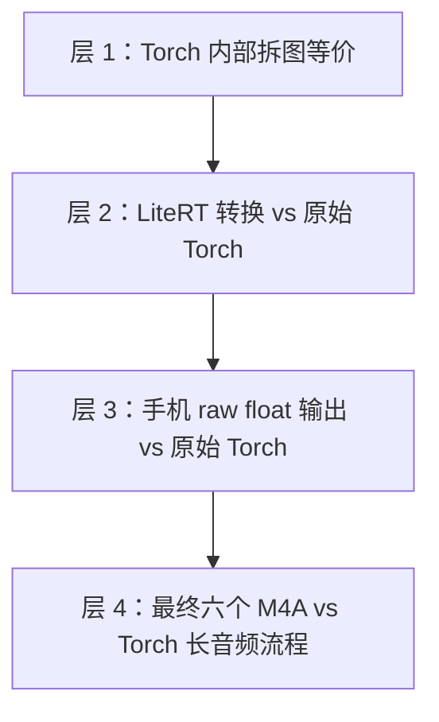

# HTDemucs 六轨模型如何运行在 Android 手机上：BandBuddy 的端侧适配、NPU 实现与评测

> 本文记录 BandBuddy 当前版本实际使用的实现与测试结果。  
> 对应模型为 `htdemucs_6s:5c90dfd2-34c22ccb`，目标设备为 Snapdragon 8 Gen 3（SM8650），端侧后端为 LiteRT/TensorFlow Lite + Qualcomm QNN HTP。

## 当前实现

BandBuddy 在 Android 端拆开了完整 PyTorch Demucs，并按实机验证结果把算子分配给 CPU 和 NPU。

处理流程如下：

1. 固定官方 `htdemucs_6s` 权重和 7.8 秒原始上下文。
2. 把 PyTorch 里的 STFT、复数张量和 iSTFT 从神经网络图中拆出去。
3. 神经网络实值核心转换为固定形状 LiteRT/TFLite 模型。
4. 用原生 C++ 完成与 PyTorch 一致的 STFT/iSTFT 边界。
5. 只把 11 个经过实机质量验证的重卷积交给 Qualcomm HTP NPU。
6. GroupNorm、注意力和其他数值敏感算子保留在 XNNPACK FP32 CPU 路径。
7. 长音频按 7.8 秒窗口、25% 重叠处理；不会再被后续窗口覆盖的 PCM 会立即写入六个连续 AAC/M4A 编码器。
8. 用原始 Torch、真实歌曲、实机中间张量和最终 M4A 做四层对照，确认结果正确，而不只确认模型能够运行。

当前 APK 中的部署模型：

| 项目 | 当前值 |
|---|---:|
| 模型 | `htdemucs_6s` |
| Torch revision | `5c90dfd2-34c22ccb` |
| 官方权重 SHA-256 | `34c22ccb381c6f9fdbf324f04e1e2fe21aaaf293f5ded163a162697ff9a02ddd` |
| 部署窗口 | 343,980 samples，7.8 秒 |
| 输入采样率 | 44,100 Hz，双声道 |
| 输出 | 鼓、贝斯、其他、人声、吉他、钢琴 |
| LiteRT 模型大小 | 117,784,760 bytes |
| LiteRT 模型 SHA-256 | `a9fcc89e84aa65313e0540b582e710007ed12064969a0d49a3c85e49f1ae4e3d` |
| 图算子数 | 3,504 |
| HTP 节点 | 11 |
| HTP 分区 | 7 |
| 其余路径 | XNNPACK FP32，4 线程 |

实机日志如下：

```text
TfLiteQnnDelegate delegate: 11 nodes delegated out of 3504 nodes with 7 partitions.
QnnGraph_execute done. status 0x0
```

这段日志确认 QNN 已创建 HTP 分区。当前运行时是受控的 CPU + NPU 混合图，不是 CPU-only。

---

## 1. 产品目标决定了模型部署方式

BandBuddy 的定位是一台纯本地六轨练习机：

```text
本地歌曲
  → 手机上离线分轨
  → 六条本地音轨
  → 日常练习只做同步播放、Mute/Solo、循环和变速
```

模型只在“生成六轨”时工作。分轨完成以后，用户练习时不会再次运行 HTDemucs。

这一产品边界直接决定了部署方案：

- 不要求实时分轨，但要求结果稳定、可恢复。
- 可以接受一次性的几十秒 NPU 初始化。
- 必须把完整歌曲处理完并原子提交六轨，不能留下半套结果。
- 推理质量优先，不能为了“全 NPU”而接受失真的输出。
- 所有输入、临时 PCM、模型输出和练习状态都留在应用私有目录。

应用清单没有网络权限，并显式移除了依赖可能带入的网络状态权限。分轨由 WorkManager 前台任务执行，取消、失败和重试都有明确状态。

---

## 2. 完整 Demucs 为什么不能直接转换

HTDemucs 同时包含两条分支：

- 频域分支：波形经过 STFT，进入二维卷积和 Transformer。
- 时域分支：原始波形进入一维编码器/解码器。

最后，频域分支经过 iSTFT 回到波形，再和时域分支相加。

完整 PyTorch 前向中包含多种端侧转换器难以处理的操作：

- 复数张量。
- `view_as_real` / `view_as_complex`。
- STFT 和 iSTFT。
- reflect padding 与特定裁剪规则。
- 随窗口长度变化的频谱时间维。
- 导出器无法稳定捕获的伪随机位置编码调用。

把这些内容全部放进一张 ONNX 或 LiteRT 图，通常会出现以下问题：

- 转换失败；
- 出现大量小分区；
- DSP 算子回退；
- NPU 图切换开销大于收益；
- 输出虽然有数值，但与原始模型不一致。

因此项目采用了“神经网络核心 + 原生 DSP 外壳”的结构。



核心拆分代码来自 POC 中的 `HTDemucsCore` 包装器。当前仓库的转换脚本会从：

```text
<POC_ROOT>/poc/android-demucs/scripts/export_core_model.py
```

载入同一份包装器，保证 POC 和正式导出使用相同的图定义。

---

## 3. 第一步：固定原始模型与可复现基线

端侧适配首先固定三件事：

```text
模型名       htdemucs_6s
revision     5c90dfd2-34c22ccb
权重 SHA     34c22ccb...a02ddd
```

每个导出和评测脚本都会重新计算权重 SHA-256。只要权重文件不是这一份，脚本直接终止。

模型输出顺序也固定为：

```text
drums, bass, other, vocals, guitar, piano
```

固定这些信息可以防止两个很隐蔽的问题：

1. Demucs 仓库或缓存中下载到另一个同名权重。
2. 模型输出顺序和 Android 枚举顺序不同，导致“声音是对的，但轨道标签错了”。

### 3.1 消除不可导出的伪随机位置编码

该 checkpoint 的 `sin_random_shift` 本来就是 `0`，上游实现仍会调用一次 `random.randrange(1)`。它永远只能返回零，但 `torch.export` 仍会把它视为不可捕获的 Python 随机行为。

适配层把它替换为固定 `shift=0` 的正弦位置编码。这个改动：

- 不改权重；
- 不改数学结果；
- 只让导出图变得确定。

### 3.2 验证拆图与原始前向等价

先在 PyTorch 内部做完整的等价性对照：

```text
原始 model(mix)

对比

HTDemucsCore(mix, spec)
  → frequency output
  → 原始 model._ispec()
  → 加上 time output
```

当前报告中，这两个结果：

```text
max absolute error = 0
correlation        = 1.0
```

拆掉 STFT/iSTFT 以后，神经网络核心仍是原模型前向的等价重排。

---

## 4. 第二步：把复数边界改成实值张量契约

原始 STFT 的复数形状是：

```text
[batch, channel, frequency, frame] complex
```

端侧模型把实部和虚部相邻放在通道维：

```text
[B, C, F, T] complex
  → view_as_real
  → permute
  → [B, C*2, F, T] float32
```

双声道因此变成四个实值通道：

```text
L.real, L.imag, R.real, R.imag
```

六轨频域输出则是：

```text
[1, 6, 4, 2048, 336]
```

当前固定模型 ABI：

| 张量 | 形状 | 含义 |
|---|---|---|
| `mix` | `[1, 2, 343980]` | 双声道平面波形 |
| `spec_channels` | `[1, 4, 2048, 336]` | 双声道频谱实部/虚部 |
| `frequency_channels` | `[1, 6, 4, 2048, 336]` | 六轨频域输出 |
| `time_waveform` | `[1, 6, 2, 343980]` | 六轨时域分支输出 |
| 最终结果 | `[1, 6, 2, 343980]` | iSTFT 后与时域分支相加 |

其中：

```text
336 = ceil(343980 / 1024)
```

固定形状的好处是：

- QNN 可以提前编译并缓存图；
- 内存上限可计算；
- JNI 边界可以做严格尺寸检查；
- 每次运行不需要重新分配 tensor；
- 更容易逐张量和 Torch 做对照。

代价是长歌曲必须由应用自己分块。

---

## 5. 第三步：用 ONNX 作中间参考，再导出 LiteRT

ONNX 在当前项目中主要承担“独立中间参考”的角色；Android 正式运行的是 LiteRT/TFLite。

转换脚本是 [`tools/export_litert_model.py`](../tools/export_litert_model.py)。

它完成四件事：

1. 加载并校验固定 Torch 权重。
2. 构造实值 `HTDemucsCore`。
3. 用 ONNX Runtime 运行 ONNX 核心。
4. 用 `litert_torch.convert()` 直接生成 LiteRT FlatBuffer。

关键转换参数：

```python
litert_torch.convert(
    core,
    (mix, spec_channels),
    strict_export=True,
    lightweight_conversion=True,
    enable_x64=False,
)
```

最初的 PyTorch、ONNX、LiteRT 三方对照结果：

| 路径 | 最终六轨相关系数 | 最大绝对误差 |
|---|---:|---:|
| ONNX vs PyTorch | 0.9999999941 | 9.50e-5 |
| LiteRT vs PyTorch | 0.9999999999 | 1.54e-5 |

原始 LiteRT 模型：

```text
117,765,808 bytes
SHA-256 ad8223d5769dbf85b12b6b9496787b49815153aa7ae597ea90b26a05ff6cc0ce
```

这一步验证的是转换精度。HTP FP16 的实机精度还需要单独验证。

---

## 6. 第四步：定位并修复 NPU 白噪声

最早把较大范围的图交给 HTP FP16 后，模型能完成推理，却产生了接近白噪声的结果。

这类故障不会触发运行时错误：输出都是有限浮点数，但音频已经失真。

### 6.1 根因：先求和、后除法导致 FP16 中间溢出

HTDemucs 的 GroupNorm 方差在 LiteRT 图里会出现类似序列：

```text
mean = reduce_sum(x) * (1 / N)
centered = x - mean
squared = centered * centered
variance = reduce_sum(squared) * (1 / N)
```

数学上没有问题，但 FP16 最大有限值约为 65,504。

当归一化轴很长时：

```text
reduce_sum(squared)
```

可能在乘以 `1/N` 之前就溢出成 `Inf`。后续归一化、激活和解码会把错误扩散成噪声。

### 6.2 数学等价的安全改写

项目增加了 [`tools/rewrite_fp16_safe_reductions.py`](../tools/rewrite_fp16_safe_reductions.py)，把：

```text
sum(centered²) / N
```

改写为：

```text
scaled = centered * sqrt(1 / N)
variance = sum(scaled²)
```

两者数学等价：

```text
sum((centered * sqrt(1/N))²)
= sum(centered² / N)
= sum(centered²) / N
```

后一种写法在求和前缩小每一项，使 FP16 部分和保持在合理范围。

脚本按完整算子模式识别目标，不依赖容易变化的 tensor 编号：

```text
SUM → MUL → SUB → MUL → SUM → MUL
```

当前 7.8 秒模型共安全改写 34 处，生成：

```text
117,784,760 bytes
SHA-256 a9fcc89e84aa65313e0540b582e710007ed12064969a0d49a3c85e49f1ae4e3d
```

### 6.3 生产图的两层数值保护

完成安全改写后，生产版本仍用两层限制保护数值精度：

1. 模型文件中的高风险方差归约已经做代数安全改写。
2. QNN 分区仍只允许经过验证的重卷积上 HTP；归一化和注意力留在 FP32 CPU。

这两层限制可以降低图融合或分区变化再次引入同类错误的风险，同时保持已经验证过的数值稳定性。

---

## 7. 第五步：为什么最后选择“8 秒版”

项目曾经尝试 2 秒、4 秒和 6 秒固定窗口。

短窗口会减小端侧资源压力：

- activation 更小；
- HTP 图更容易编译；
- 单次峰值内存更低；
- 首次验证更快。

但 HTDemucs 依赖上下文。窗口越短，即使 LiteRT 与同长度 Torch 完全一致，也会和原始 7.8 秒模型产生可听差异。

F1 片段的 Torch 上下文实验：

| 应用窗口 | 与桌面 no-shift Torch 的相关系数 | SNR |
|---:|---:|---:|
| 2 秒 | 0.97929 | 13.83 dB |
| 4 秒 | 0.98739 | 15.93 dB |
| 6 秒 | 0.99246 | 18.18 dB |

评测时要分开看两个误差来源：

- **转换误差**：LiteRT 和相同短窗口 Torch 是否一致？
- **上下文误差**：短窗口 Torch 和原始 7.8 秒 Torch 是否一致？

2 秒 LiteRT 对 2 秒 Torch 的相关系数可以达到 `0.99999999999`，但它依然不等于原始 7.8 秒模型，因为丢失了上下文。

因此当前版本回到 checkpoint 原生的：

```text
7.8 秒 = 343,980 samples
```

项目里所说的“8 秒版”，指的就是这个 7.8 秒固定窗口。

---

## 8. 第六步：设计并验证混合 NPU 图

生产运行时见 [`ModelRuntime.kt`](../app/src/main/java/com/lonelyme/bandbuddy/engine/ModelRuntime.kt)。

### 8.1 把 3,504 个节点全部交给 HTP 时遇到的问题

全图或宽范围委托遇到了两类问题：

1. 归一化、注意力等 FP16 数值误差会污染输出。
2. 7.8 秒时域分支的末端卷积 activation 很长，QNN 图准备会碰到 VTCM/tiling 限制，出现长时间停在 `QnnGraph_finalize`，甚至进程被系统终止。

SM8650 实机日志曾提示图峰值 TCM 超过安全阈值。尤其是末端两层：

- 节点 `3307`：长时间轴 Conv1d。
- 节点 `3487`：最终长时间轴 ConvTranspose1d，输出长度约 343,984。

它们在短窗口上可以工作，但在原始 7.8 秒窗口上不适合作为稳定生产分区。

### 8.2 当前交给 HTP 的 11 个节点

```text
586, 867,
2639, 2645, 2777, 2784, 2923, 2929,
3157, 3164, 3303
```

它们覆盖频域编码器和多级解码器中的高计算量卷积/转置卷积。两个最长的末端时域卷积留在 CPU。

QNN 配置：

```kotlin
setBackendType(HTP_BACKEND)
setHtpPrecision(HTP_PRECISION_FP16)
setHtpUseConvHmx(HTP_CONV_HMX_ON)
setHtpPerformanceMode(HTP_PERFORMANCE_BURST)
setHtpOptimizationStrategy(HTP_OPTIMIZE_FOR_PREPARE)
setSkipNodeIds(CPU_NODE_IDS)
```

其余节点由 XNNPACK FP32、4 线程执行。

### 8.3 NPU 优先，缺失时回退到 CPU FP32

正式代码会检查：

- JNI DSP ABI 是否匹配；
- 模型 asset 是否存在且字节数正确；
- 设备是否暴露 HTP FP16 capability；
- QNN delegate 是否可用；
- 输入输出 tensor 形状是否与固定 ABI 一致。

JNI DSP ABI、模型文件和 tensor ABI 仍是强制条件。HTP FP16 capability
缺失时，代码不会创建 QNN delegate，而是直接用 LiteRT/XNNPACK 的 4 线程
FP32 CPU 路径执行完整图；如果 capability 存在但 QNN/FastRPC 在初始化阶段
失败，也会记录原始错误并自动回退 CPU。设置页和分轨进度会明确显示
“CPU FP32 兼容模式”，不会把 CPU-only 执行标成 NPU 加速。

`libcdsprpc.so` 在 Android manifest 中因此声明为可选。没有 FastRPC 的设备
仍可安装应用，只是不会进入 HTP 路径。

CPU 回退已在一台不暴露 `HTP_RUNTIME_FP16` 的 SM8250、Android 13、
6 GB RAM 平板上做过实机门禁。LiteRT 创建 XNNPACK CPU delegate 后接管
3,504 个节点中的 3,156 个，其余节点由内置 CPU kernel 执行；连续两个
7.8 秒零输入窗口分别耗时约 10.3 秒和 9.3 秒，tensor ABI、完整推理和
有限值检查均通过。该结果只证明回退链路可执行，其他设备仍需单独测量
真实歌曲的耗时和内存峰值。

### 8.4 编译缓存

QNN 编译缓存位于：

```text
code_cache/qnn-htp/
```

token 包含模型窗口和模型哈希：

```text
bandbuddy-htdemucs-6s-7p8s-mixed-a9fcc89e-v1
```

模型变化后不会误用旧缓存。

缓存能避免重复图编译，但冷进程仍要加载 QNN/HTP runtime 和 CDSP skeleton。首次启动可能需要几十秒，目标设备上冷启动最慢接近一分钟。

---

## 9. 第七步：用 C++ 复刻 PyTorch 的 STFT/iSTFT 边界

实现位于 [`native_demucs.cpp`](../app/src/main/cpp/native_demucs.cpp)。

固定 DSP 参数：

| 参数 | 值 |
|---|---:|
| FFT size | 4096 |
| hop size | 1024 |
| 模型频率 bins | 2048 |
| window | Hann |
| 外侧 reflect pad | 1536 |
| center pad | 2048 |
| 声道 | 2 |
| 输出平面 | 6 × 2 = 12 |

### 9.1 预处理

预处理按左右声道并行：

1. 按 Demucs 规则做 reflect index。
2. 截取 4096 点窗口。
3. 乘 Hann window。
4. 运行 radix-2 FFT。
5. 除以 `sqrt(4096)`。
6. 把实部/虚部写入 `[4, 2048, frames]`。

### 9.2 后处理

对 12 个“声部 × 声道”平面并行：

1. 从模型输出恢复实部/虚部。
2. 构造共轭对称频谱。
3. 运行 iFFT。
4. Hann overlap-add。
5. 用窗口平方和包络做归一化。
6. 按 PyTorch crop 规则截取。
7. 加上时域分支输出。

后处理使用 4 个 native worker，预处理使用 2 个声道线程。

### 9.3 Direct buffer 的内存布局

Kotlin 侧的所有 tensor 都是 `allocateDirect()`：

```text
mix       约 2.75 MB
spec      约 11.01 MB
frequency 约 66.06 MB
time      约 16.51 MB
output    约 16.51 MB
```

合计约 107.6 MiB direct buffer。

这些缓冲区在一个 `DemucsWindowSeparator` 会话中只分配一次并反复复用，JNI 通过 `GetDirectBufferAddress()` 直接读写，避免每个片段复制一份巨型数组。

### 9.4 DSP 的验收方法

instrumented test 会：

- 对照 PyTorch `_spec` 的固定频点/帧值，容差 `0.002`；
- 把 mix 频谱直接送入 native iSTFT；
- 检查稳定区间最大重建误差不超过 `5e-5`；
- 检查整窗平均误差不超过 `0.0012`。

测试入口是：

```text
nativeStftMatchesPyTorchAndReconstructsTheWindow
```

---

## 10. 第八步：Android 中的一次窗口推理

[`DemucsWindowSeparator.kt`](../app/src/main/java/com/lonelyme/bandbuddy/engine/DemucsWindowSeparator.kt) 把一次窗口分离固定为三段：

```text
native preprocess
    ↓
QNN HTP + XNNPACK neural core
    ↓
native postprocess
```

伪代码如下：

```kotlin
mix.put(stereoPlanar)
NativeDemucsBridge.preprocess(mix, spec)

session.run(
    inputs = arrayOf(mix, spec),
    outputs = mapOf(0 to frequency, 1 to time)
)

NativeDemucsBridge.postprocess(frequency, time, output)
```

运行时会记录：

- native STFT 时间；
- LiteRT/QNN wall time；
- LiteRT native inference time；
- native iSTFT 时间；
- QNN profiling 数据。

生产实机连续两次零输入测试：

| 阶段 | 第一次 | 第二次 |
|---|---:|---:|
| STFT | 70.12 ms | 44.85 ms |
| 神经核心 wall time | 8622.99 ms | 8084.60 ms |
| iSTFT | 147.01 ms | 109.44 ms |
| 总窗口时间 | 8851.89 ms | 8240.69 ms |

这里的计时不包含 `DemucsWindowSeparator` 构造阶段的首次 QNN 图准备。包含构造和两次推理的 instrumented test 总时间约 47.5 秒。

项目尚未完成同等条件下的 CPU-only 基准测试，因此这里记录的是：

- HTP 路径已经执行；
- 当前混合图可以连续完成推理；
- 每个 7.8 秒窗口约需 8.2 秒；

现阶段不报告未经严格测量的“比 CPU 快多少倍”。

---

## 11. 第九步：长歌曲如何变成六条连续音轨

长音频逻辑位于 [`LongSongSeparator.kt`](../app/src/main/java/com/lonelyme/bandbuddy/engine/LongSongSeparator.kt)。

### 11.1 统一输入格式

[`AudioDecoder.kt`](../app/src/main/java/com/lonelyme/bandbuddy/engine/AudioDecoder.kt) 用 Android `MediaExtractor + MediaCodec` 解码本地音频。

内部标准格式：

```text
little-endian float32
44.1 kHz
stereo interleaved
```

单声道会复制成双声道。非 44.1 kHz 输入使用线性插值重采样。

### 11.2 25% overlap

生产窗口：

```text
WINDOW = 343980 samples = 7.8 s
STRIDE = WINDOW × 3/4 = 257985 samples = 5.85 s
```

也就是 25% 重叠。

每个窗口使用三角权重：

```text
w(i) = (i + 1) / half             i < half
w(i) = (WINDOW - i) / half        i >= half
```

重叠区输出：

```text
y(t) = Σ window_k(t) × weight_k(t) / Σ weight_k(t)
```

### 11.3 “8/34”不是 34 条分轨

界面中的：

```text
处理音频片段 8/34 · 最终输出 6 轨
```

含义是“正在处理第 8 个时间窗口，共 34 个时间窗口”，不是模型要输出 34 条轨。

例如 F1 校准音频：

```text
时长       193.66 s
帧数       8,540,296
stride     257,985
窗口数     ceil(8,540,296 / 257,985) = 34
```

“乌云典当记”约 481.27 秒，对应约 83 个窗口。

模型始终只输出六轨。

### 11.4 不把所有窗口结果堆在内存里

每次推理得到 12 个平面：

```text
6 stems × 2 channels
```

程序只保留一个滑动 accumulator。只要前 `STRIDE` 帧不会再被未来窗口覆盖，就立刻：

1. 除以累计权重；
2. 写入六个输出编码器；
3. 把 accumulator 向前移动；
4. 清空尾部；
5. 继续处理下一个窗口。

因此内存不会随歌曲时长线性增长。

这种实现不再缓存整首歌曲的所有窗口输出，也解决了“处理到若干片段后闪退”的问题。

---

## 12. 连续 AAC/M4A 输出

当前实现为六轨各保留一个持续存活的 AAC-LC 编码器，不会为每个窗口单独生成 MP3。

见 [`AacM4aWriter.kt`](../app/src/main/java/com/lonelyme/bandbuddy/engine/AacM4aWriter.kt)。

每条轨道参数：

```text
AAC-LC
44.1 kHz
stereo
160 kbps
M4A container
```

这样做的原因是：

- 单窗口文件会反复产生编码器 priming；
- 拼接压缩片段容易出现缝隙和时间戳漂移；
- 六轨必须共用严格时间轴；
- Android 平台原生 AAC 编码器和 M4A muxer 可直接使用；
- PCM 一旦离开重叠区就能编码并写入文件，及时释放未压缩数据，降低存储占用。

目标设备的 AAC 编码器会产生 2,048 帧 priming。程序保留这些 AAC packet，但把 PTS 向前移动 2,048 帧，使 MP4 编辑时间线从第一帧真实 PCM 开始。

F1 端到端测试结果：

```text
encoder lead frames      0
trailing padding frames  480
```

六个编码器从歌曲开始一直存活到结束，所以六轨不会因每段重新启动编码器而错位。

### 12.1 原子提交

输出先写到：

```text
stems.part/
```

六个编码器全部正常关闭后，才重命名为：

```text
stems/
```

任务失败或取消时删除 `stems.part`。曲库不会把半成品标记成“可练习”。

标准化中间 PCM 在成功后删除，只保留原始音频、波形索引和六个 M4A。

---

## 13. 第十步：模型和 QNN runtime 如何打进 APK

关键构建配置位于 [`app/build.gradle.kts`](../app/build.gradle.kts)。

### 13.1 固定依赖

```text
TensorFlow Lite Java  2.17.0
QNN runtime Maven     2.48.0
QNN LiteRT delegate   2.48.0
ABI                    arm64-v8a
minSdk                 29
```

### 13.2 模型不压缩

```kotlin
androidResources {
    noCompress += setOf("tflite")
}
```

这样可以通过 `AssetFileDescriptor + FileChannel.map()` 直接映射模型，而不是先复制 117 MB 文件。

### 13.3 QNN native library 必须解压

```kotlin
packaging {
    jniLibs {
        useLegacyPackaging = true
    }
}
```

CDSP daemon 不能直接从 APK 压缩条目映射 HTP skeleton，因此 native library 要解压到应用 native library 目录。

Manifest 声明：

```xml
<uses-native-library
    android:name="libcdsprpc.so"
    android:required="true" />
```

这是 Android 12 以后访问公开 FastRPC native library 所需的声明。

---

## 14. INT8 量化实验及弃用结果

INT8 是否进入 APK，由体积和音质评测结果决定。

量化脚本是 [`tools/quantize_litert_model.py`](../tools/quantize_litert_model.py)，方案为：

```text
PyTorch PT2E static INT8
conv / linear kernels
weight: symmetric per-channel INT8
activation: affine per-tensor INT8
```

校准数据：

| 歌曲 | 校准窗口 | 非重叠 holdout |
|---|---:|---:|
| F1 | 3 | 1 |
| 乌云典当记 | 3 | 1 |

共 396 个 observer、410 个量化边界，其中 132 个 per-channel 边界。

量化结果如下：

| 项目 | FP32 | INT8 |
|---|---:|---:|
| 文件大小 | 117,765,808 | 118,619,928 |
| 体积变化 | — | **增加 0.725%** |

部分量化图保留了大量 FP32 路径，又加入 Quantize/Dequantize 和 scale 元数据，因此没有形成紧凑的全 INT8 图，文件反而变大。

体积没有下降，音质也没有达到部署门槛：

| 声部 | holdout 最差相关系数 | 最差 SNR |
|---|---:|---:|
| drums | 0.0402 | -0.86 dB |
| bass | 0.5826 | 1.17 dB |
| other | 0.2160 | 0.18 dB |
| vocals | -0.0116 | -37.51 dB |
| guitar | 0.0001 | -42.66 dB |
| piano | 0.0412 | -20.42 dB |

质量门槛是：

```text
每轨 correlation >= 0.99
每轨 SNR         >= 25 dB
```

六轨全部失败，因此 INT8 模型被拒绝，没有进入 APK。

当前的“混合精度”具体指：

```text
HTP 上经过验证的卷积使用 FP16/HMX
其余敏感图使用 FP32
```

这里的混合精度不包含 INT8 量化模型。

---

## 15. 四层评测：从模型张量到最终 M4A

端侧音频模型需要逐层检查转换、实机推理、长音频处理和最终编码结果。



### 15.1 指标

主要指标：

```text
MAE   = mean(|candidate - reference|)
RMSE  = sqrt(mean((candidate - reference)²))
NRMSE = RMSE / reference_RMS
SNR   = 20 log10(reference_RMS / error_RMS)
Corr  = 去均值后的 Pearson correlation
```

另外检查：

- 最大绝对误差；
- 输出 RMS；
- 输出 peak；
- NaN / Inf；
- `abs(sample) >= 0.999` 的削波比例；
- AAC 起始延迟和尾部 padding；
- 六轨解码长度是否一致。

### 15.2 为什么相关系数和 SNR 要一起看

相关系数擅长判断形状是否一致，但对整体增益不敏感。

SNR 会惩罚增益、偏置和逐样本误差，但在几乎静音的声部上会显得很低。

两类指标的用法如下：

- 模型转换看相关系数、最大误差和 SNR；
- 最终音频还看 peak、clipping、时长和 AAC 对齐；
- 安静的 piano/guitar 不能只看一个相对 SNR。

---

## 16. 当前评测结果

### 16.1 安全 LiteRT 模型 vs 原始 Torch

确定性输入：

| 指标 | 结果 |
|---|---:|
| correlation | 0.99999999985 |
| SNR | 95.11 dB |
| max abs error | 1.63e-5 |

真实歌曲同窗口：

| 数据 | correlation | SNR | max abs error |
|---|---:|---:|---:|
| F1 | 0.99999999989 | 96.61 dB | 1.92e-5 |
| 乌云典当记 | 0.99999999994 | 98.90 dB | 2.12e-5 |

部署测试门槛：

```text
correlation >= 0.99999
max abs error <= 0.001
```

结果通过部署门槛。

### 16.2 手机 raw float 最终输出 vs 原始 Torch

这层同时覆盖：

- Android native STFT；
- QNN HTP FP16 卷积；
- XNNPACK FP32 剩余图；
- Android native iSTFT；
- 两分支相加。

| 数据 | correlation | SNR | peak |
|---|---:|---:|---:|
| F1 | 0.9999986303 | 55.62 dB | 0.818 |
| 乌云典当记 | 0.9999991523 | 57.70 dB | 0.965 |

门槛：

```text
correlation >= 0.99999
SNR >= 50 dB
```

结果通过实机质量门槛。

### 16.3 最终六个 M4A vs 原始 Torch overlap-add

这一层加入了：

- 长音频分块；
- 25% overlap；
- 三角加权；
- 流式 PCM → AAC；
- M4A 时间戳；
- 再次解码。

F1 8 秒端到端结果：

| 指标 | 结果 |
|---|---:|
| correlation | 0.998524 |
| SNR | 25.18 dB |
| peak | 0.805 |
| clipped fraction | 0 |
| AAC lead | 0 frames |
| AAC tail padding | 480 frames |

门槛：

```text
correlation >= 0.99
SNR >= 20 dB
每轨 clipped fraction < 1e-4
```

结果通过端到端质量门槛。

### 16.4 为什么与“桌面默认 Demucs”会再低一些

标准桌面 `Separator` 还包含：

- 默认 split 策略；
- overlap；
- 一次随机 shift ensemble；
- 与应用略不同的边界组合。

同一份官方 Torch，把“应用匹配的固定窗口、三角 overlap-add、no-shift 流程”与“桌面默认 split、25% overlap、一次 shift 流程”直接对照：

```text
app-matched Torch OLA vs standard desktop Torch
correlation = 0.991225
SNR         = 17.50 dB
```

即使两边都运行原始官方 Torch 模型，只要长音频编排和 shift 设置不同，结果就不会逐样本完全相同。

最终手机 M4A 与标准桌面默认路径：

```text
correlation = 0.989871
SNR         = 16.94 dB
```

判断端侧转换是否正确，应优先看“相同窗口、相同 overlap、相同 shift 设置”的原始 Torch 对照。标准桌面比较用于描述用户可能听到的配置差异，不能把全部差异都归因于 NPU。

---

## 17. 性能与内存

目标设备连续运行时的窗口耗时约为：

```text
8.24 秒 / 7.8 秒模型窗口
```

长音频 stride 是 5.85 秒，因此只看神经核心，处理量约为音频时长的：

```text
8.24 / 5.85 ≈ 1.41 倍
```

再加首次 runtime 准备、解码、AAC 和文件 I/O。

粗略示例：

| 音频 | 窗口数 | 仅窗口推理估算 |
|---|---:|---:|
| F1，193.66 秒 | 34 | 约 4.7 分钟 |
| 乌云典当记，481.27 秒 | 83 | 约 11.3 分钟 |

当前分轨速度低于实时，UI 也没有承诺实时处理。

实机图准备期间观察到的内存大致为：

```text
PSS 约 372–409 MB
RSS 约 495–536 MB
```

组成包括：

- 117.8 MB 模型；
- 约 107.6 MiB direct tensor buffer；
- QNN/XNNPACK arena；
- 长音频 accumulator；
- Kotlin/MediaCodec/native runtime。

复用 tensor 和流式写轨后，内存不再随歌曲长度增长；7.8 秒 HTDemucs 本身仍是高内存任务。

---

## 18. 如何复现转换与评测

以下命令使用占位路径：

```text
POC_ROOT   BandBuddy-android-poc 根目录
MODEL_ROOT 官方 Torch 权重缓存目录
```

当前保存报告所对应的转换环境为 PyTorch `2.11.0+cpu`、ONNX Runtime `1.26.0`、LiteRT Torch `0.9.1`。模型转换与 Python 评测在 WSL/Linux Python 环境中运行；Android 构建、安装和 instrumented test 在 Windows/ADB 环境中运行。

### 18.1 导出原始 LiteRT

```bash
python tools/export_litert_model.py \
  --poc-root "$POC_ROOT" \
  --model-root "$MODEL_ROOT" \
  --onnx "$POC_ROOT/poc/android-demucs/artifacts/htdemucs_6s.core.onnx" \
  --output build/qnn-model/htdemucs_6s.core.tflite \
  --report build/qnn-model/three-runtime-validation.json
```

### 18.2 做 FP16-safe 方差改写

```bash
python tools/rewrite_fp16_safe_reductions.py \
  build/qnn-model/htdemucs_6s.core.tflite \
  build/qnn-model/htdemucs_6s.core.8s.fp16-safe.tflite \
  --exclude-nodes 1291:2203 \
  --report build/qnn-model/htdemucs_6s.core.8s-fp16-safe-rewrite.json
```

### 18.3 用原始 Torch 和两首真实歌曲验证

```bash
python tools/export_short_litert_model.py \
  --poc-root "$POC_ROOT" \
  --model-root "$MODEL_ROOT" \
  --samples 343980 \
  --validation-pcm build/calibration/f1-mix.f32le \
  --validation-pcm build/calibration/wuyun-diandangji-mix.f32le \
  --reuse-existing \
  --output build/qnn-model/htdemucs_6s.core.8s.fp16-safe.tflite \
  --report build/qnn-model/htdemucs_6s.core.8s.fp16-safe-validation.json
```

### 18.4 查看和映射 LiteRT 节点

```bash
python tools/inspect_litert_nodes.py \
  build/qnn-model/htdemucs_6s.core.8s.fp16-safe.tflite \
  586 867 2639 2645 2777 2784 2923 2929 3157 3164 3303
```

如果重新导出导致 operator index 变化，可使用：

```bash
python tools/map_litert_nodes.py OLD_MODEL NEW_MODEL 586 867 ...
```

### 18.5 构建 Android

```powershell
.\gradlew.bat :app:assembleDebug :app:assembleDebugAndroidTest
```

### 18.6 在真机验证生产模型

```powershell
adb install -r -t -g app\build\outputs\apk\debug\app-debug.apk
adb install -r -t -g app\build\outputs\apk\androidTest\debug\app-debug-androidTest.apk

adb shell am instrument -w -r `
  -e class "com.lonelyme.bandbuddy.DemucsInferenceInstrumentedTest#zeroWindowRunsThroughNativeDspAndQnnHtpCore" `
  com.lonelyme.bandbuddy.test/androidx.test.runner.AndroidJUnitRunner
```

然后检查日志中是否同时存在：

```text
11 nodes delegated
7 partitions
QnnGraph_execute done. status 0x0
```

只看测试返回 `OK` 不足以证明 NPU 已被使用。

### 18.7 复测 NPU/GPU FP16/FP32 候选

完整 7.8 秒图的 HTP 全量/宽覆盖/卷积专用 FP16、GPU
全量/宽覆盖/卷积专用 FP16/FP32，以及生产混合方案的实机矩阵见
[`backend-candidate-validation.md`](backend-candidate-validation.md)。

设备端候选由
[`InferenceBackendCandidateInstrumentedTest.kt`](../app/src/androidTest/java/com/lonelyme/bandbuddy/InferenceBackendCandidateInstrumentedTest.kt)
逐进程运行；可执行候选再由
[`validate_backend_candidates.py`](../tools/validate_backend_candidates.py)
统一对照固定官方 Torch 权重。

---

## 19. 关键代码和报告索引

### Android 运行时

- [`ModelRuntime.kt`](../app/src/main/java/com/lonelyme/bandbuddy/engine/ModelRuntime.kt)：QNN/HTP 分区、缓存、tensor ABI。
- [`DemucsWindowSeparator.kt`](../app/src/main/java/com/lonelyme/bandbuddy/engine/DemucsWindowSeparator.kt)：单窗口 direct buffer 推理。
- [`native_demucs.cpp`](../app/src/main/cpp/native_demucs.cpp)：STFT、iSTFT、reflect/crop、两分支相加。
- [`LongSongSeparator.kt`](../app/src/main/java/com/lonelyme/bandbuddy/engine/LongSongSeparator.kt)：长音频分块、overlap-add、流式写轨。
- [`AudioDecoder.kt`](../app/src/main/java/com/lonelyme/bandbuddy/engine/AudioDecoder.kt)：解码和 44.1 kHz 标准化。
- [`AacM4aWriter.kt`](../app/src/main/java/com/lonelyme/bandbuddy/engine/AacM4aWriter.kt)：连续 AAC/M4A 编码和 priming 修正。
- [`SeparationWorker.kt`](../app/src/main/java/com/lonelyme/bandbuddy/worker/SeparationWorker.kt)：单任务、前台通知、取消和失败状态。

### 转换与评测

- [`tools/export_litert_model.py`](../tools/export_litert_model.py)：Torch/ONNX/LiteRT 三运行时转换验证。
- [`tools/rewrite_fp16_safe_reductions.py`](../tools/rewrite_fp16_safe_reductions.py)：FP16-safe 方差改写。
- [`tools/export_short_litert_model.py`](../tools/export_short_litert_model.py)：固定窗口和真实歌曲转换质量。
- [`tools/quantize_litert_model.py`](../tools/quantize_litert_model.py)：INT8 PT2E 校准与 holdout。
- [`tools/validate_device_against_torch.py`](../tools/validate_device_against_torch.py)：手机 raw tensor/final PCM 对原始 Torch。
- [`tools/validate_e2e_stems_against_torch.py`](../tools/validate_e2e_stems_against_torch.py)：最终六个 M4A 对 Torch 长音频流程。
- [`tools/validate_backend_candidates.py`](../tools/validate_backend_candidates.py)：NPU/GPU 候选的双真实窗口 Torch 质量门禁。
- [`DemucsInferenceInstrumentedTest.kt`](../app/src/androidTest/java/com/lonelyme/bandbuddy/DemucsInferenceInstrumentedTest.kt)：真机 DSP、QNN、AAC、播放和端到端测试。
- [`InferenceBackendCandidateInstrumentedTest.kt`](../app/src/androidTest/java/com/lonelyme/bandbuddy/InferenceBackendCandidateInstrumentedTest.kt)：HTP/GPU FP16/FP32 候选矩阵。

### 当前核心报告

- [`three-runtime-validation.json`](../build/qnn-model/three-runtime-validation.json)
- [`htdemucs_6s.core.8s.fp16-safe-validation.json`](../build/qnn-model/htdemucs_6s.core.8s.fp16-safe-validation.json)
- [`device-original-window-8s-vs-official-torch.json`](../build/qnn-model/device-original-window-8s-vs-official-torch.json)
- [`e2e-f1-7p8-prod-vs-official-torch.json`](../build/qnn-model/e2e-f1-7p8-prod-vs-official-torch.json)
- [`int8-vs-torch-validation.json`](../build/qnn-model/int8-vs-torch-validation.json)

---

## 20. 当前限制与下一步

当前版本的已知边界如下：

1. **NPU 分区仍有硬件特定性**
   当前生产 NPU 分区只在 SM8650 实机上完成系统评测。其他 Snapdragon 如果 QNN 初始化失败会自动回退 CPU；非 HTP 设备直接使用完整 FP32 CPU 图。CPU 路径的速度和内存占用仍需按设备实测。

2. **分轨速度低于实时**
   7.8 秒上下文保留了接近原模型的质量。已验证的混合 NPU 路径中，纯窗口推理成本约为音频时长的 1.4 倍；CPU 回退速度随 SoC、散热和可用内存变化，不能沿用该数字。

3. **标准桌面配置并非逐样本相同**  
   桌面默认 shift ensemble 与应用的固定 no-shift 流程存在可测差异。

4. **AAC 是有损输出**  
   raw float 对 Torch 的 SNR 超过 55 dB；最终 M4A 因 AAC 降到约 25 dB。练习用途可接受，如需科研级导出，应增加无损 FLAC/WAV 选项。

5. **吉他和钢琴是较难声部**  
   安静或复杂编曲下，相对 SNR 和串音会比鼓、人声更敏感。

6. **INT8 尚不可用**  
   下一轮量化应考虑 QAT、可实际打包的 weight-only 路径或 QNN 原生量化；当前失败的 PT2E 部分量化图继续保持未部署状态。

可继续优化的方向：

- 针对不同 SoC 保存独立 HTP 节点配置；
- 生成离线 QNN context binary，减少首次图准备；
- 使用更高性能的 FFT 库或 NEON 优化 native DSP；
- 增加“高质量 shift ensemble”可选模式；
- 增加无损分轨输出；
- 对整首 F1 和“乌云典当记”建立自动回归基线；
- 在更多歌曲和更多 Snapdragon 代际上建立质量/速度矩阵。

---

## 结语：当前方案的取舍

桌面级音乐分离模型移植到手机上，把 `.th` 转成 `.tflite` 只是第一步。

完整部署还要同时处理四件事：

```text
数学等价
数值稳定
硬件可执行
长音频工程完整性
```

BandBuddy 当前实现如下：

- 保留 HTDemucs 原始 7.8 秒上下文；
- 用 C++ 接管复杂 DSP 边界；
- 用真实 HTP 分区加速经过验证的重卷积；
- 把敏感图留在 FP32；
- 拒绝未过门槛的 INT8；
- 分别对原始 Torch 输出和最终 M4A 做验证。

发布前必须完成可重复评测，并跑通完整的长音频流程。“全 NPU”“模型变小了”或 Demo 能出声音，都不能单独作为发布依据。
